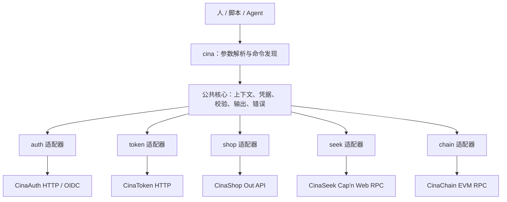

# 总体架构与认证方案

状态：架构方案；更新日期：2026-09-07。M0、M1、M2 首批 Auth status / Shop 适配已实现；Auth 浏览器登录与 Seek 仍为后续设计。实际能力以 README 和 cina schema 为准。

## 1. 设计决定

| 决定 | 原因 |
| --- | --- |
| 独立仓库、单一 npm 包 | 首版统一安装和版本发布，便于直接使用 `cina` |
| TypeScript + Node.js，仓库使用 pnpm | 接近现有产品的类型与客户端生态；支持 Windows、macOS、Linux |
| 五个产品模块内置，按需加载 | 产品边界清楚；帮助和 schema 不必加载 RPC、链上依赖 |
| 核心层与产品适配层分开 | HTTP、Cap'n Web RPC、EVM JSON-RPC 各自保留正确语义 |
| 本地命令注册表作为契约来源 | 参数校验、帮助、schema、执行入口使用同一份定义 |
| 业务只读命令作为 v0.1 范围 | 先验证认证、输出、实际接口与运行环境，再扩展写操作 |

M0 使用 Node.js >=24.14.1 <25、pnpm 11.19.0、TypeScript 7.0.2、Zod 4.5.4，并将 @napi-rs/keyring 2.0.0 作为按需加载的可选原生依赖。暂不拆分五个独立发布包、第三方插件市场或中心转发服务。现有 `@cinaauth/cli` 保留开发工具职责，未来 `cina auth` 负责产品操作。

## 2. 执行边界



业务请求由对应产品服务端鉴权。CLI 选择正确凭据并规范输入、输出；本地 schema 和上下文不构成服务端权限。

模块职责规划如下；M0 中较小的核心模块先使用单文件，产品目录在实际接入时建立：

```text
src/
  bin.ts
  core/
    commands/       # 注册表、参数校验、schema 导出
    context/        # 命名环境、产品资源选择、配置迁移
    credentials/    # 凭据提供器、系统凭据库、刷新协调
    transport/      # 超时、取消、有限重试、HTTP 通用处理
    output/         # 人类输出、JSON、后续 NDJSON
    errors/         # 稳定错误码和退出码
  products/
    auth/
    token/
    shop/
    seek/
    chain/
test/
  contracts/
  integration/
docs/
```

产品适配器负责定义命令、认证要求、上游调用及结果转换。核心层只调用接口，不导入其他仓库的数据库、Worker 入口或前端组件。类型复用应使用可固定版本的公共契约包；没有可发布类型包时，为已核验的小范围接口维护独立 DTO 和契约测试，不使用本机相邻目录依赖。

CinaSeek 的 RPC stub 属于有生命周期的能力对象，不能直接序列化为 JSON；适配器提取数据 DTO，结束、取消和异常路径都释放 stub 与连接。

## 3. 环境和资源上下文

使用命名 context，例如 `development`、`staging`、`production`。名称是用户定义的配置标识，不证明服务的部署状态。

每个 context 保存：

| 字段 | 含义 |
| --- | --- |
| 各产品 endpoint | Auth issuer / API base、Token gateway、Shop API base、Seek RPC、Chain RPC |
| Auth clientId | 此环境已注册的 CLI public client 标识 |
| Auth organizationId | CinaAuth 组织选择 |
| Token workspaceId | CinaToken 工作区选择 |
| Shop accountId | 开放接口账号标识；不假定它具有多店铺切换能力 |
| Seek workspaceId | CinaSeek 工作区选择 |
| Chain chainId | 预期网络编号，与 RPC 返回值核对 |
| credentialRefs | 系统凭据库的非敏感引用，不包含令牌 |

上下文选择优先级：`--context` > `CINA_CONTEXT` > 已保存的当前 context。业务资源参数只覆盖当前调用，不悄悄修改持久配置。首版不从当前项目目录自动加载能改变 endpoint 或认证的配置。

`--org` 仅在明确支持该组织契约的命令上接受；`--workspace` 属于当前产品。CinaAuth 组织、CinaToken 工作区、CinaSeek 工作区和 Shop 账号不能根据同名或相同 ID 自动关联。

endpoint 变更使该服务原有凭据绑定失效，需重新选择或验证。生产与测试凭据分开。服务环境与链网络分开：例如名为 production 的网站仍可能连接测试链，输出必须展示实际 chainId。

## 4. 认证：统一管理，按产品授权

### 4.1 CinaAuth 身份登录

`cina login` 默认向 context 配置的 CinaAuth 发起浏览器登录：

1. 使用已经注册的 public client，采用 Authorization Code + PKCE S256。
2. 在明确的 loopback IP 和临时端口接收回调，使用系统浏览器完成认证。
3. 校验 state、OIDC nonce、issuer、ID token audience、签名及有效期。
4. 通过 discovery 返回的端点交换授权码并获取 userinfo。
5. 保存已授权凭据及其 issuer、subject、audience、scope 和有效期。

CLI 不携带客户端共享密钥。授权服务器需支持此 CLI 的 loopback 回调注册与匹配规则。方案遵循 [RFC 8252](https://datatracker.ietf.org/doc/html/rfc8252)，刷新与令牌保护遵循 [RFC 9700](https://www.rfc-editor.org/info/rfc9700/)。

默认只申请已部署支持的身份 scope：`openid profile email`；持久登录需服务端允许 `offline_access` 并实际签发 refresh token。不存在刷新令牌时，过期后重新登录。

ID token 用于客户端验证登录结果；产品 API 使用其支持的访问凭据。登录成功只说明 CinaAuth 身份认证完成，不声明已经获准调用其管理 API或其他产品 API。

### 4.2 设备授权

`cina login --device` 列入后续阶段，依赖服务端实际发布标准 OAuth 设备授权端点、允许相应 grant，并注册 CLI 客户端。实现遵循 [RFC 8628](https://www.rfc-editor.org/info/rfc8628/)，处理等待授权、降低轮询频率、拒绝、过期和取消。

当前 CinaAuth Worker 启用的是独立 `deviceAuthorization()`。库内另外提供 `oauthDeviceAuthorization()`，两者不能同时安装为重复设备授权插件。不能仅因页面存在设备码入口就把其令牌当作多产品 OAuth access token，也不能直接替换插件而跳过现有设备登录回归验证。

### 4.3 首版产品凭据

| 产品能力 | 首版凭据 | 接入方式 |
| --- | --- | --- |
| CinaAuth userinfo | CLI public client 获得的 OAuth access token | `cina login` |
| CinaToken 模型和当前 Key 归属/预算信息 | Gateway API key | 从显式环境变量或安全输入导入 |
| CinaToken 管理工作区 | Management API key | 独立 scheme 与凭据引用 |
| CinaShop 开放接口 | appid/appsecret 换取的开放接口 token | 产品登录流程，接口权限由服务端检查 |
| CinaSeek 工作区 | Seek 自己的 session token | 按部署提供的 gatekeeper 浏览器登录流程取得 |
| CinaChain 公共链读取 | 通常不需要 CinaAuth 身份 | 使用配置的 RPC，供应商密钥如有则单独绑定 |

`cina login --product <product>` 选择产品认证流程。Token 需要明确选择 gateway 或 management；Shop 通过安全输入接收 appsecret；Seek 先读取部署登录配置。非交互执行可以提供明确产品、环境和凭据类型的输入。

系统只读取明确约定的凭据变量，例如 `CINA_TOKEN_GATEWAY_KEY`、`CINA_TOKEN_MANAGEMENT_KEY`、`CINA_SHOP_APP_ID`、`CINA_SHOP_APP_SECRET`、`CINA_SEEK_SESSION_TOKEN`。这些变量绑定本次选定 context 和 endpoint；不扫描其他应用、浏览器或相邻仓库凭据。显式环境变量优先于已保存凭据且不自动持久化；不同 scheme 不能回退替用。

凭据元数据至少区分 context、product、endpoint/issuer、scheme、principal、resource/audience 和已获 scope。principal 未经服务端验证时标记 unknown，不凭本地 JWT 解码认定身份。

### 4.4 单点登录的后续接入

目标是同一 CinaAuth 身份按目标产品获得权限。每个产品仍需校验 access token 的 issuer、audience、有效期和 scope，并映射本地账号、组织或工作区权限。

资源范围方案参考 [RFC 8707](https://www.rfc-editor.org/info/rfc8707/)；是否使用直接验签、introspection 或受控的服务端会话桥接，应由该产品接口契约明确。不会自动把当前 scope 扩大，也不会在 CLI 中分发 CinaAuth 与产品之间的服务端桥接密钥。

拟议的业务 scope 必须先经产品服务端注册和执行，不能仅写入 schema 就宣称已支持。当前 Worker 配置中的身份 scope 不足以证明具备 `auth users list` 等管理权限。

## 5. 凭据生命周期

- 本地配置文件只保存非敏感参数与产品凭据修订号；系统凭据键由 context ID、产品、endpoint、scheme 和修订号派生。持久存储适配器使用 @napi-rs/keyring，连接 Windows Credential Manager、macOS Keychain、Linux Secret Service，且仅在凭据操作时加载。
- 系统凭据库不可用时，支持显式环境变量或仅本进程使用的安全输入；需要持久保存的操作明确返回不可用，不静默写入明文配置。
- 不支持把密钥直接作为常规命令行参数；可通过隐藏输入、明确的 stdin 输入或 CI 注入。诊断、schema、日志、错误输出都不回显秘密。
- 同一凭据的 refresh 需要进程间协调和原子更新，避免轮换后旧 refresh token 覆盖新值。refresh 结果不确定时，不盲目重复提交。
- `logout` 删除所选产品的本地凭据，若服务端提供对应撤销能力则尝试撤销。输出分别标明 localCleared 和 remoteRevocation；导入的 API key 默认仅移除本地副本，不擅自吊销仍被其他系统使用的 key。
- 核心身份 logout 不隐含撤销全部产品凭据，产品级与全产品退出须明确选择；命令也不能从父进程移除环境变量，需在结果中说明相关凭据来源仍由调用方管理。

## 6. 请求和版本行为

默认 HTTP/RPC 单次超时建议 30 秒；登录使用独立截止时间。用户可显式调整，所有路径支持取消。认证材料只发给绑定端点；业务请求不自动跟随跨源重定向转发凭据。

只有注册表声明为可重试的幂等读取，才对临时网络错误、429 和可恢复 5xx 作有限重试；遵守 Retry-After 和总时间限制。不因 HTTP 方法是 POST 就认定写操作，也不因方法名像读取就跳过副作用核查。

CLI 版本与 `schemaVersion`、输出 `contractVersion` 分开。0.x 阶段也记录破坏性变更；流水线固定 CLI 版本。上游响应不兼容时返回 `UPSTREAM_CONTRACT_MISMATCH`，不把解析失败当成空列表。

首版 `schema` 来源于本地随包注册表，可离线使用；当前部署可用性由 `doctor` 检查并单独报告。无可验证的服务端版本或能力信号时报告 unknown。后续如引入远程能力发现，不允许远程描述任意执行本机命令。

## 7. 当前实现边界

M0 已实现配置的严格版本校验、写入锁和原子替换；产品配置发生变化时提升凭据修订号，即使把 endpoint 改回旧值也不复用旧绑定。配置锁遇到并发写入直接报冲突；若进程异常退出遗留 config.lock，需确认没有写入进程后手动移除，CLI 不自动抢占锁。

凭据适配器提供读取、保存、删除、过期检查和产品环境隔离。M1 开放 Token key 导入和本机退出，M2 首批接入 Shop appid/appsecret 登录、带进程间锁的显式刷新和退出；OAuth 刷新协调及旧修订记录清理后续接入。显式变量只覆盖本次绑定，明确 login 才持久保存。Shop 仅保存服务端返回的 token 和已验证账号元数据，不保存 appsecret。Seek session 和 Chain RPC key 变量仍为核心预留，Chain 当前使用公开 RPC。

doctor 的网络检查仅打开 TCP/TLS 连接，不验证产品协议、用户权限或部署版本；Auth/Token/Shop/Chain 均有实际命令，Seek 仍为 not-implemented。Auth 当前仅接入 discovery，不代表浏览器登录已经完成。通用 JSON transport 具备截止时间、取消、响应大小限制、有限读取重试和禁止跟随重定向等行为。产品命令的轻量定义可离线加载，实际 handler 在执行时动态导入。
